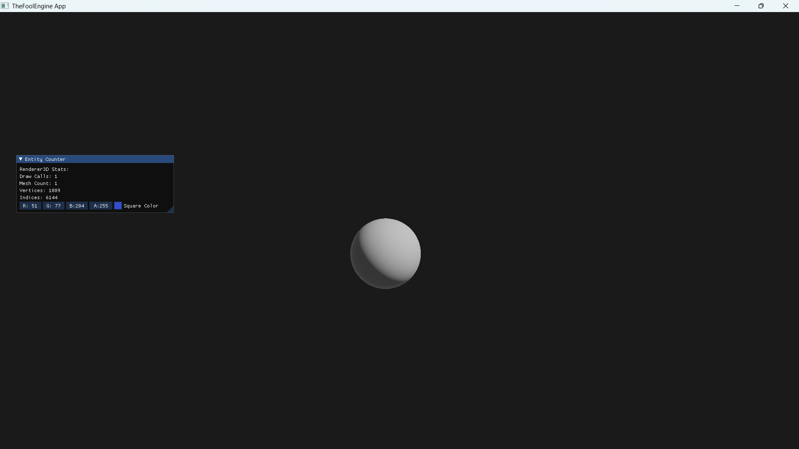
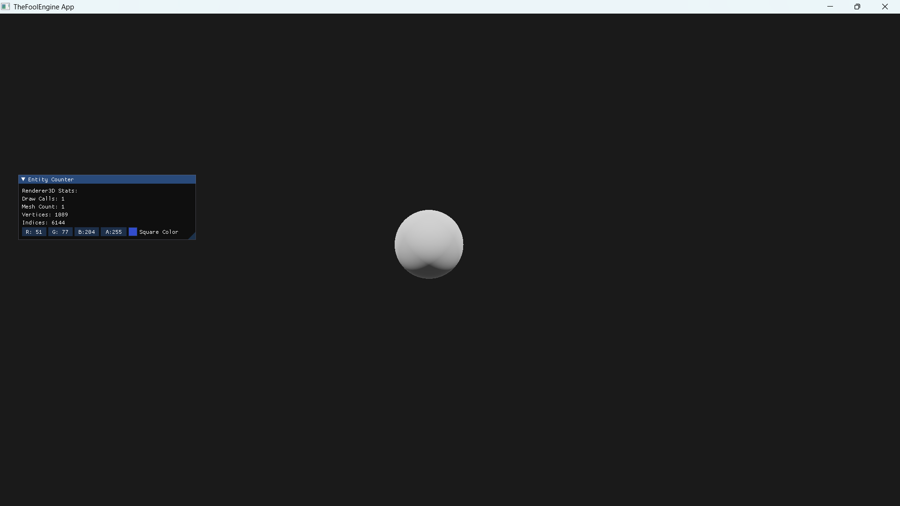
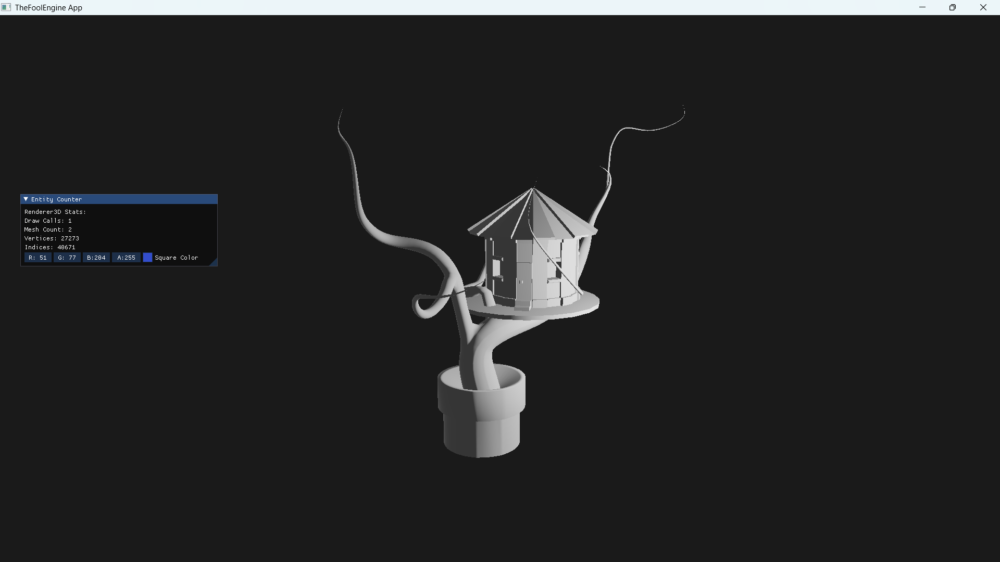

# TheFoolEngine
TheFoolEngine

该项目仍然处于早期的研发阶段。截止至下一次修改前，仅用于仓库管理员的简历展示。

项目简述：
  基于Hazel引擎的软件架构，拓展出3D的部分。

**👉 [详细项目介绍与设计理念](docs/txt/TheFoolEngine-Introduction.txt)** - 了解项目的详细介绍（纯文本介绍，比较乏味，后续会逐渐改进）

已实现功能：
  1、基础的渲染管线；
  2、批处理渲染；
  3、PBR光照系统。

##  🎨 核心特性
### 现代渲染能力
- **基于物理的渲染(PBR)** - 实现完整的金属度/粗糙度工作流
- **实时多光源支持** - 方向光和点光源光照
- **高级材质系统** - 支持多种材质类型和Shader管理
- **3D模型导入** - 基于Assimp的完整模型加载管线

### ⚡ 性能优化
- **自动批处理系统** - 基于材质ID的Draw Call优化
- **分层渲染架构** - 清晰的渲染管线分离
- **资源生命周期管理** - 智能的资源加载和释放
- **自定义内存管理** - 优化的缓冲区分配策略

### 🔧 工程化设计
- **跨平台渲染抽象** - 支持多图形API(OpenGL/计划Vulkan)
- **模块化架构** - 解耦的引擎子系统
- **事件驱动系统** - 响应式的输入和消息处理

## 🖼️ 视觉展示
目前仅支持OBJ和GLB文件格式。
### 渲染效果
| 单光源场景 | 多光源场景 | 模型渲染（OBJ） |
| :---: | :---: | :---: |
|  |  |  |

### 架构概览
┌─────────────────────────────────────────┐
│ 应用层 │ # 用户交互与业务逻辑
├─────────────────────────────────────────┤
│ 引擎层 ┌──────────────┬─────────────────┐ │
│ │ 渲染模块 │ 核心模块 │ │
│ │ ► 批处理系统 │ ► 事件系统 │ │
│ │ ► PBR管线 │ ► 层堆栈管理 │ │
│ │ ► 相机系统 │ ► 输入封装 │ │
│ └──────────────┼─────────────────┤ │
│ │ 资源模块 │ 平台模块 │ │
│ │ ► 材质系统 │ ► 窗口管理 │ │
│ │ ► 模型加载 │ ► 系统抽象 │ │
│ └──────────────┴─────────────────┘ │
└─────────────────────────────────────────┘
